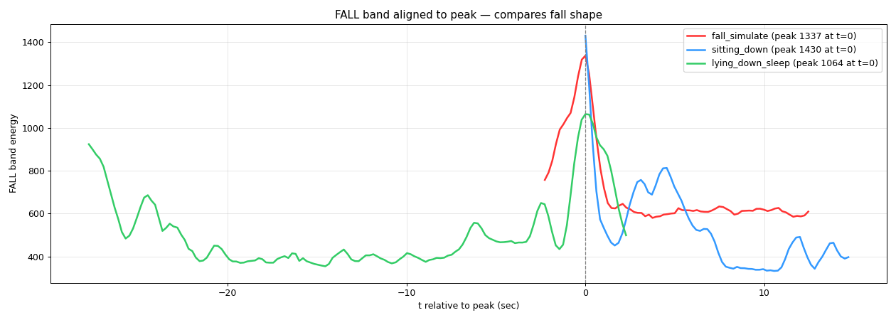

# Kisum Fall Detection — WiFi CSI + 60 GHz mmWave prototype

An experimental fall-detection / ambient-monitoring prototype that combines:

- **WiFi CSI** from a pair of ESP32-C6 boards (motion level, presence, rough
  breathing estimate),
- **Seeed MR60FDA2** 60 GHz mmWave module (presence + fall),
- **Seeed MR60BHA2** 60 GHz mmWave module (presence + breathing + heart rate),

fused in a single Python/Tk dashboard (`unified_monitor.py`).

The main finding: **single-antenna WiFi CSI alone could not reliably detect
falls** in our tests. It could not tell a fall from lying down in bed or from
sitting still. That is why a dedicated mmWave fall sensor was added and CSI was
kept as a motion / presence layer. Details are in
[`docs/EXPERIMENT_NOTES.md`](docs/EXPERIMENT_NOTES.md).

The background story — how the idea came about, what the prototype (called
*SilentGuardian* there) showed, and where WiFi sensing is oversold — is in the
original write-up on LinkedIn:
[From WiFi DensePose to a working demo — what the AI engine picked up, and what the field oversells](https://www.linkedin.com/pulse/from-wifi-densepose-working-demo-what-ai-engine-picked-juan-wang-yivue/)
(July 2026).

> [!WARNING]
> **This is an experimental research prototype, not a medical device.**
> It has not been clinically validated or certified, and it must not be relied
> on to detect falls or monitor anyone's health or safety. All observations
> come from one person, in one home, with one set of hardware. No accuracy,
> sensitivity or specificity figures are claimed.

---

## Contents

- [Findings in brief](#findings-in-brief)
- [Hardware](#hardware)
- [Architecture](#architecture)
- [Repository layout](#repository-layout)
- [Setup](#setup)
- [Legacy CSI-only tools](#legacy-csi-only-tools)
- [Known limitations](#known-limitations)
- [Acknowledgements and third-party software](#acknowledgements-and-third-party-software)
- [License](#license)

---

## Findings in brief

All of these come from the experiment notes. See
[`docs/EXPERIMENT_NOTES.md`](docs/EXPERIMENT_NOTES.md) for the context and the
caveats.

**WiFi CSI (single receive antenna, amplitude only)**

- A rule-based detector (motion burst → stillness) rejected walking, walking out
  of the room, and an empty room. It could not reliably reject sitting still,
  and it **cannot distinguish a fall from intentionally lying down**. It is
  really a "vertical motion → horizontal stillness" transition detector.
- Fixed thresholds drifted between sessions. Thresholds relative to a rolling
  5-minute p10 baseline helped with drift but did not break the ceiling above.
- Hypothesis "breath-band energy reveals posture": **disproven**. The lying /
  standing ratio was 0.64, against a predicted ≥ 2, because postural sway while
  standing dominates the breath band.
- The effective radius for detailed motion was about 2 m from the receiver.
- A completely motionless person is nearly invisible to CSI (the "still-person
  hole").

**MR60FDA2 (fall)**

- Desk mount and 2.1 m wall mount: `falling_information` fired within seconds of
  any person being detected, i.e. it was unusable.
- 2.5 m ceiling mount with `install_height = 2.5 m` and `sensitivity = 1`:
  walking and squatting were rejected, and simulated falls fired within roughly
  5–15 s. Sensitivity 2 produced false falls on squatting.
- Presence (`person_information`) was reliable in every placement.

**MR60BHA2 (vitals)**

- At a desk, the respiratory rate decayed to implausible values (down to 1/min)
  when the user sat still.
- In the fusion, an out-of-range mmWave breath value falls back to the CSI
  estimate or shows "—". The CSI breath / heart-rate estimates were **not**
  validated against a reference device.



*Fall-band (6–25 Hz) CSI energy, aligned to the peak, for fall_simulate,
sitting_down and lying_down_sleep from one labeled session (2026-07-17). The
per-band time series for all five scenarios are in
[`docs/images/timeseries_all_scenarios.png`](docs/images/timeseries_all_scenarios.png).*

---

## Hardware

| Item | Qty | Role |
|---|---|---|
| ESP32-C6 dev board | 2 | CSI sender (`csi_send`) + CSI receiver (patched `console_test`, USB serial to the PC) |
| [Seeed MR60FDA2](https://wiki.seeedstudio.com/getting_started_with_mr60fda2_mmwave_kit/) 60 GHz fall detection kit (XIAO ESP32-C6, ESPHome pre-flashed) | 1 | Fall + presence, WiFi |
| [Seeed MR60BHA2](https://wiki.seeedstudio.com/getting_started_with_mr60bha2_mmwave_kit/) 60 GHz breathing & heartbeat kit (XIAO ESP32-C6, ESPHome pre-flashed) | 1 | Breathing, heart rate, presence, distance, WiFi |
| USB webcam (optional) | 1 | MediaPipe pose heatmap panel |
| Windows PC | 1 | Runs the dashboard |

Placement used in the final setup (from the notes):

- CSI boards placed horizontally about 1 m apart, with the person in between.
- MR60FDA2 ceiling-mounted at 2.5 m, pointing straight down, with at least 1 m
  of clear floor radius.
- MR60BHA2 on a desk, 0.6–1 m from the user.

---

## Architecture

```
 ESP32-C6 #1 (csi_send) ── ESP-NOW ──► ESP32-C6 #2 (patched console_test)
                                              │ USB serial, 2 Mbaud
                                              │ CSI_DATA lines (HT-LTF, base64)
                                              ▼
 ┌──────────────────────────── unified_monitor.py ───────────────────────────┐
 │ CSIBackend      amplitude → 2 s FFT every 0.2 s → bands breath/slow/walk/  │
 │                 fall → motion level vs. rolling p10 baseline               │
 │                 10 s FFT → breath / heart-rate estimates (experimental)    │
 │                 FallDetectorV2 (burst → stillness), reference only         │
 │ ESPHomeBackend  aioesphomeapi over WiFi (mDNS → fallback IP → LAN scan     │
 │  ×2             with hostname identity check)                              │
 │                 MR60FDA2: person_information, falling_information          │
 │                 MR60BHA2: person, respiratory rate, heart rate, distance   │
 │ PoseBackend     webcam → MediaPipe PoseLandmarker → heatmap (optional)     │
 │ fuse()          presence / motion / breath / heart / fall rules            │
 │ Tk UI           Living Room tab | Bedroom tab | Events tab                 │
 │ Alerts          optional Telegram bot (fall + inactivity) + on-screen      │
 │                 "Family App" preview                                       │
 └────────────────────────────────────────────────────────────────────────────┘
```

**Fusion rules (as implemented in `fuse()` and `App._tick_ui()`)**

| Signal | Rule |
|---|---|
| Presence (Living Room) | MR60BHA2 or CSI |
| Presence / Fall (Bedroom) | MR60FDA2 only |
| Motion level | CSI only: STILL / LIGHT / ACTIVE / INTENSE |
| Breath | MR60BHA2 if in [8, 30]/min → else CSI if in range → else "—" |
| Heart rate | average of MR60BHA2 and CSI if both in [40, 180] bpm → else whichever is in range |
| Fall | MR60FDA2 `falling_information` (CSI detector shown for reference only) |

---

## Repository layout

```
unified_monitor.py        Fusion dashboard (final version)
pose_stickfigure.py       MediaPipe pose / anonymisation helpers (also a standalone CLI)
legacy/                   CSI-only tools from Phase 1 (PyQt monitor + data recorders)
patches/                  Patch for Espressif esp-csi console_test (Apache-2.0)
docs/EXPERIMENT_NOTES.md  Public edition of the experiment notes
docs/images/              Plots from the labeled CSI session
requirements.txt          Python dependencies for unified_monitor.py
```

---

## Setup

Tested on **Windows 11 with Python 3.13**. The dashboard uses Windows-specific
calls (`ctypes.windll`, PowerShell for shutdown, Chrome / Edge paths), so it will
not run unmodified on Linux or macOS. The Python commands below use Windows
`cmd` syntax; the ESP-IDF commands work in any ESP-IDF shell.

### 1. Flash the CSI boards (ESP-IDF v5.5.4)

```bash
git clone https://github.com/espressif/esp-csi.git
cd esp-csi
git checkout 8633d67152db2808f141cc1595970aa9cf406045
git apply /path/to/kisum-fall-detection/patches/console_test.patch

# Sender (unmodified example)
cd examples/get-started/csi_send
idf.py set-target esp32c6
idf.py -p <SENDER_PORT> flash

# Receiver (patched)
cd ../../esp-radar/console_test
idf.py set-target esp32c6
idf.py -p <RECEIVER_PORT> flash
```

The receiver then streams `CSI_DATA` lines at 2 Mbaud. See
[`patches/README.md`](patches/README.md) for what the patch changes.

> When opening the receiver's serial port yourself, do **not** force
> `dtr=False, rts=False`. In our setup that toggled the auto-reset circuit and
> left the board in bootloader mode until it was re-plugged.

### 2. Put the mmWave modules on your WiFi

Both modules ship with ESPHome.

1. On first boot, each module opens an AP (e.g. `seeedstudio-mr60fda2`).
2. Join it and enter your WiFi credentials in the captive portal at
   `http://192.168.4.1`.
3. After that, each module is reachable as
   `seeedstudio-mr60fda2-kit-<suffix>.local` /
   `seeedstudio-mr60bha2-kit-<suffix>.local` on port 6053. The suffix differs
   per unit; you can find it in your router's client list or with an mDNS
   browser.

For MR60FDA2, set `install_height` to your real mount height and
`sensitivity = 1`. You can do this from Home Assistant / ESPHome.

> The ESPHome API on our units accepted connections **without a password**.
> Enable ESPHome API encryption for anything beyond a lab test.
> `unified_monitor.py` currently connects without a key.

### 3. Install the Python dependencies

```bash
python -m venv .venv
.venv\Scripts\activate
pip install -r requirements.txt
```

The version numbers in `requirements.txt` are the versions the hardware was
run with. A fresh install today may pull newer releases. If the ESPHome
connection or the webcam misbehaves, try the tested versions first, e.g.
`pip install aioesphomeapi==45.7.0 opencv-python==4.13.0.90`.

The MediaPipe models (`pose_landmarker_lite.task`, `selfie_segmenter.tflite`)
are **not** included. On first run, `pose_stickfigure.ensure_model()` downloads
them from Google's MediaPipe model storage into `mediapipe_models/` next to the
script, about 6 MB.
The URLs are listed at the top of `pose_stickfigure.py`. See the
[MediaPipe Pose Landmarker documentation](https://developers.google.com/edge/mediapipe/solutions/vision/pose_landmarker)
for details and terms.

### 4. Run the dashboard

```bash
python unified_monitor.py ^
    --csi-port COM5 ^
    --fda2-host seeedstudio-mr60fda2-kit-xxxxxx.local ^
    --bha2-host seeedstudio-mr60bha2-kit-xxxxxx.local
```

Any source you leave out is shown as "not configured", so you can start with
CSI only, or with mmWave only. Every flag can also be set through an environment
variable:

| Flag | Env var | Meaning |
|---|---|---|
| `--csi-port` | `CSI_PORT` | Serial port of the receiver C6 |
| `--fda2-host` / `--bha2-host` | `FDA2_HOST` / `BHA2_HOST` | ESPHome mDNS hostnames (used for discovery and identity check) |
| `--fda2-ip` / `--bha2-ip` | `FDA2_IP` / `BHA2_IP` | Optional fallback IPs |
| `--lan-prefix` | `LAN_PREFIX` | /24 prefix scanned as a last resort (default `192.168.1.`) |
| `--no-pose` | — | Disable webcam + MediaPipe |
| `--webcam N` | — | Webcam index (default 0) |
| `--telegram-web` | — | Open Telegram Web (Chrome/Edge app window) next to the monitor |

**Optional Telegram alerts.**

1. Create a bot with @BotFather.
2. Send the bot one message and read your chat id from
   `https://api.telegram.org/bot<TOKEN>/getUpdates`.
3. Set the token and chat id before launching:

```bash
set TELEGRAM_BOT_TOKEN=<your token>
set TELEGRAM_CHAT_ID=<your chat id>
```

Without them, alerts appear only in the on-screen preview. Never commit a real
token.

**Other toggles in the UI:**

- "record CSV log" writes 1 Hz rows to `unified_logs/`.
- "● REC" saves an MP4 of the monitor window to `demo_recordings/`.

Both folders are git-ignored. **Only record people who have consented.**

Run the Tk app from a standalone terminal (Windows Terminal / PowerShell). In
our tests the VSCode integrated terminal sometimes failed to return to the
prompt after the app closed.

---

## Legacy CSI-only tools

`legacy/` holds the Phase 1 tools that led to the "CSI alone is not enough"
conclusion. They need PyQt5 and pyqtgraph as well
(`pip install -r legacy/requirements.txt`).

```bash
python legacy/kisum_radar_monitor.py --port COM5    # live Doppler bands + FallDetectorV2
python legacy/record_labeled_data.py --port COM5    # 5 labeled scenarios → recordings/*.csv
python legacy/record_posture_data.py --port COM5    # 4 posture scenarios → recordings/*.csv
```

Only one program can hold the receiver's serial port at a time.

---

## Known limitations

- **No validated accuracy.** No accuracy figures exist: there was one subject,
  one home, and the number of trials was not recorded.
- **CSI fall detection.** It cannot distinguish falls from intentionally lying
  down or from sitting still (single antenna, amplitude only).
- **CSI coverage.** Detailed motion was detected only within ~2 m, and a
  motionless person is nearly invisible.
- **MR60FDA2 placement.** It depends heavily on placement and needs a proper
  ceiling mount. Observed fall latency was ~5–15 s.
- **MR60BHA2 breath rate.** It was unreliable when the user sat still at a desk
  (it decayed to 1/min).
- **CSI vitals.** The breath / heart-rate estimates are experimental and
  unvalidated. The heart-rate fusion is a plain average with no divergence
  check.
- **Not tested.** Continuous vibration (e.g. nearby construction), multiple
  people, and pets.
- **Platform.** Windows-only as written. The ESPHome API is used without
  encryption.

---

## Acknowledgements and third-party software

This project builds on, and links to, the following. None of their code is
vendored here except the esp-csi patch.

- **[espressif/esp-csi](https://github.com/espressif/esp-csi)** (Apache-2.0):
  `csi_send` and `console_test` firmware, `esp-radar` component. Our
  modifications are in [`patches/`](patches/).
- **[ESP-IDF](https://github.com/espressif/esp-idf)** (Apache-2.0).
- **Seeed Studio MR60FDA2 / MR60BHA2** kits and their ESPHome integrations:
  - [MR60FDA2 wiki](https://wiki.seeedstudio.com/getting_started_with_mr60fda2_mmwave_kit/)
  - [MR60BHA2 wiki](https://wiki.seeedstudio.com/getting_started_with_mr60bha2_mmwave_kit/)
  - [ESPHome `seeed_mr60fda2`](https://esphome.io/components/seeed_mr60fda2.html)
- **[aioesphomeapi](https://github.com/esphome/aioesphomeapi)** (MIT): ESPHome
  native API client.
- **[MediaPipe](https://github.com/google-ai-edge/mediapipe)** (Apache-2.0):
  pose landmarker and selfie segmenter.
- **One Euro Filter**: Casiez, Roussel, Vogel (CHI 2012),
  <https://gery.casiez.net/1euro/>, used for landmark smoothing.
- **OpenCV, NumPy, pySerial, mss, Pillow**, and **PyQt5 / pyqtgraph** (legacy
  tools).
- **[Telegram Bot API](https://core.telegram.org/bots/api)**, optional alerts.

---

## License

The code in this repository is released under the [MIT License](LICENSE).

[`patches/console_test.patch`](patches/console_test.patch) modifies
Apache-2.0-licensed files from espressif/esp-csi and stays under the
**Apache License 2.0** (see [`patches/README.md`](patches/README.md)).

Third-party libraries keep their own licenses. Note that PyQt5, used only by
`legacy/`, is GPL-3.0 or commercially licensed.
